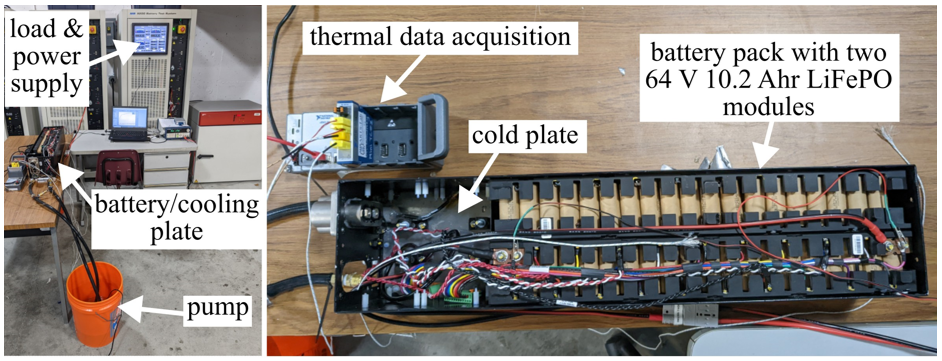

# Comprehensive Understructure Benchmark for Intelligent Control (CUBICS)
A structure designed to test autonomous  sensor deployment using UAVs

Figure 1: An image of an existing battery pack connected to the developed data acquisition system.

## Licensing and Citation

This work is licensed under a Creative Commons Attribution-ShareAlike 4.0 International License [cc-by-sa 4.0].

Cite this as: 

@Misc{ARTSBatteryPackBMS,    
  author = {ARTS-Lab},  
  howpublished = {GitHub},  
  title  = {Comprehensive Understructure Benchmark for Intelligent Control {(CUBICS})},  
  groups = {ARTS-Lab},    
  url    = {https://github.com/ARTS-Laboratory/Comprehensive-Understructure-Benchmark-for-Intelligent-Control},   
}
